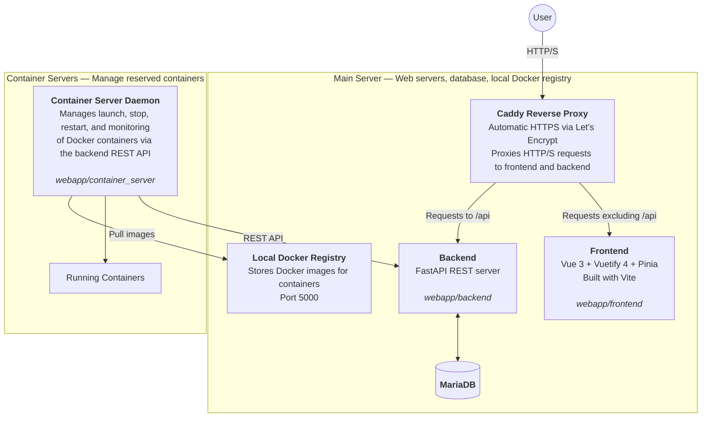

# Containers on the Fly
> Instant Up. Timely Down. Simple web-based Docker container reservation platform.

[](LICENSE)


## Description

With this Web app, users permitted to access the app can easily reserve Docker containers with hardware resources needed for their projects. The user can select the start and end time for the container reservation. Multiple servers can be integrated for reservations.

Users can login with username & password combination, or through LDAP. Includes also admin-level management tools in the web app.

Originally created in Satakunta University of Applied Sciences to give AI students a solution to handle their AI calculating in a dedicated server.

## Research & Publications

This project has been featured in the following academic publications:
- [Containers on the Fly: A Web-Based Docker Container Reservation Platform](https://ieeexplore.ieee.org/document/10569705) - IEEE Access, 2024

## Screenshots

*Click on any image to view full size*

<a href="https://raw.githubusercontent.com/Satakunnan-ammattikorkeakoulu/containers-on-the-fly/main/additional_documentation/imgs/front.jpg" target="_blank">
  
</a>

<a href="https://raw.githubusercontent.com/Satakunnan-ammattikorkeakoulu/containers-on-the-fly/main/additional_documentation/imgs/reservations.jpg" target="_blank">
  
</a>

<a href="https://raw.githubusercontent.com/Satakunnan-ammattikorkeakoulu/containers-on-the-fly/main/additional_documentation/imgs/admin_computers.jpg" target="_blank">
  
</a>

<a href="https://raw.githubusercontent.com/Satakunnan-ammattikorkeakoulu/containers-on-the-fly/main/additional_documentation/imgs/reserve.jpg" target="_blank">
  
</a>

# Table of Contents
   * [Prerequisites](#prerequisites)
   * [Getting Started](#getting-started)
      * [Installing Main Server](#installing-main-server)
         * [Updating Settings](#updating-settings)
         * [Updating the Software](#updating-the-software)
      * [Installing Additional Container Servers](#installing-additional-container-servers)
         * [Updating Settings](#updating-settings-1)
         * [Updating the Software](#updating-the-software-1)
      * [Automatic Installation: Main Server](#automatic-installation-main-server)
         * [Open Ports](#open-ports)
         * [Install Required APT Packages](#install-required-apt-packages)
         * [Setup the Main Server](#setup-the-main-server)
         * [Start the Main Server](#start-the-main-server)
      * [Automatic Installation: Container Server](#automatic-installation-container-server)
         * [Open Ports](#open-ports-1)
         * [Install Required APT Packages](#install-required-apt-packages-1)
         * [Setup the Container Server](#setup-the-container-server)
         * [Start Container Server](#start-container-server)
            * [Start the Servers](#start-the-servers)
   * [Additional Tasks](#additional-tasks)
      * [Creating Reservable Containers](#creating-reservable-containers)
      * [LDAP Authentication Setup](#ldap-authentication-setup)
   * [Testing](#testing)
   * [Technical Details](#technical-details)
      * [Frontend](#frontend)
      * [Backend](#backend)
   * [Contributing](#contributing)
   * [License](#license)

## Prerequisites

- **OS**: Ubuntu 24.04 (mandatory for automated installation)
- **User**: A non-root user with sudo permissions
- **APT packages**: `make`, `lsb-release`, `python3`, `python3-pip`, `python3-venv`, `software-properties-common`

## Getting Started

The installation is split into two parts: **main server** and **container server**.

- **Main server** contains the web interface, database, and local docker registry.
- **Container server** handles starting, stopping, and restarting the reserved containers.

The container server is recommended to be installed to the same server as the main server, at least on the first install. This single-server setup is the easiest way to get up and running quickly, requiring minimal configuration and infrastructure. The container server can be deployed later to dedicated separate servers that will be used specifically for hosting and managing reserved containers. You can have unlimited amount of separate container servers from which users can reserve virtual machines.

### Installing Main Server

Main server contains the web interface, database, local docker registry. Follow these steps to install the main server:

1. Create a fresh `Ubuntu 24.04` server (NOTE! It is **mandatory** to use Ubuntu version 24.04)
2. [Install the Main Server](#automatic-installation-main-server)
3. [Install the Container Server](#automatic-installation-container-server)
4. [Create reservable containers (images)](#creating-reservable-containers)

By default, the setting `ADD_TEST_DATA` is set to true (we recommend setting it like this), which sets up the server machine, adds default docker images and adds default admin and a regular user accounts to the system automatically. The default accounts are as follows:

```
username: admin@foo.com
password: test
```

```
username: user@foo.com
password: test
```

#### Updating Settings

If you change any settings in the ``user_config/settings`` file, just run these commands again to apply the settings and to restart the servers in the main server:

```
make start-main-server
make start-container-server
```

#### Updating the Software

To update the software to latest version:

- Run ``git pull`` to pull latest changes to the application codebase
- If there were no changes pulled, then you don't need to proceed further. Otherwise, proceed further below

##### In the main server:
In the main server, run these:
```
sudo make setup-main-server
sudo make setup-container-server
make start-main-server
make start-container-server
```

##### In each additional container server (if any)
After that, update each additional container server (if any). On each additional container server (if any), run:
```
git pull
sudo make setup-container-server
make start-container-server
```

### Installing Additional Container Servers

Note that this step is only required to be followed if you have multiple (physical) servers and want reservations to be made from multiple different servers.

After the main server has been installed, it is possible to create more Ubuntu 24.04 servers in which the **container server** can run and from which container reservations can be made. If you wish to expand the main server with additional container servers, then in another servers you need to:
1. Create a fresh `Ubuntu 24.04` server (NOTE! It is **mandatory** to use Ubuntu version 24.04)
2. Run command ``sudo make allow-container-server IP=CONTAINER_SERVER_IP`` in the main server to allow connection from the container server to the main server
3. Add the computer through the main server admin web interface (Computers -> Create new Computer). Make a note of the name that you set for the computer as you need to configure this in your settings file.
4. [Install the Container Server](#automatic-installation-container-server) in the new server

#### Updating Settings

If you change any settings in the ``user_config/settings`` file, just run this command again to apply the settings and to restart the container server:

```
make start-container-server
```

#### Updating the Software

Review the section for Main Server on how to update the software on the container server.

### Automatic Installation: Main Server

> Heads up! The automatic installation script for the **main server** only works with Ubuntu Linux 24.04. It is HIGHLY RECOMMENDED (or even mandatory) to use a fresh Ubuntu installation, due to various software being installed and configured.

Before proceeding, make sure you are logged in as the user with which you want to setup the Main Server. The user should have sudo permissions. For example: `containeruser`. Do NOT install the script while logged in as the `root` user, this can cause security issues.

The installation procedure of the Main Server (web servers, database, local Docker registry, setting up firewall) is as follows:

#### Open Ports

Suppose you have an external firewall in front of your server (for example, you have the server hosted on an Azure VM, Google Cloud VM, Amazon VM, or any other hardware firewall in front of your server). In that case, you need to open these ports at least to be allowed into the server:

- `5000` (TCP/HTTP, for Docker Registry on the main server)
- `80` and `443` for HTTP / HTTPS connection to the server web interface and possible Let's Encrypt SSL certificate renewal
- `2000-3000` (default) or the range of ports from which you want to host the reserved servers, which can be configured in the settings file. These services can be any, usually SSH, but could be HTTP, HTTPS, etc...
- `3306` (TCP, for MariaDB database connection to the main server from the container servers)

#### Install Required APT Packages

Install required APT packages:
```
sudo apt update && sudo apt install make lsb-release python3 python3-pip python3-venv software-properties-common
```

#### Setup the Main Server

Start setting up the main server and it's dependencies with:

```bash
sudo make setup-main-server
```

> Note that after the initial setup the script asks you to review the ``user_config/settings`` file. You should do it before you finish the installation.

#### Start the Main Server

After the main server setup is complete, run all the main server dependencies with:

```bash
make start-main-server
```

That's it! Now you should be able to access the web interface using a browser. There will be more information printed on your console after running the `make start-main-server` command. If the servers crash or something happens, then you should only need to run the `make start-main-server` command again.

You should start by logging in as an administrator (default username ``admin@foo.com`` and password ``test``), and start configuring the settings for the application through the web interface.

### Automatic Installation: Container Server

> Heads up! The automatic installation script for the **container server** only works with Ubuntu Linux 24.04. It is HIGHLY RECOMMENDED (or even mandatory) to use a fresh Ubuntu installation, due to various software being installed and configured.

Before proceeding, make sure you are logged in as the user with which you want to setup the Container Server. The user should have sudo permissions. For example: `containeruser`. Do NOT install the script while logged in as the `root` user, this can cause security issues.

#### Open Ports

Suppose you have an external firewall in front of your server (for example, you have the server hosted on an Azure VM, Google Cloud VM, Amazon VM, or any other hardware firewall in front of your server). In that case, you need to open these ports at least to be allowed into the server:

- `2000-3000` (default) or the range of ports from which you want to host the reserved servers, which can be configured in the settings file. These services can be any, usually SSH, but could be HTTP, HTTPS, etc...

#### Install Required APT Packages

Install required APT packages:
```
sudo apt update && sudo apt install make lsb-release python3 python3-pip python3-venv software-properties-common
```

#### Setup the Container Server

Set up the container server with:

```bash
sudo make setup-container-server
```

> Note that after the initial setup the script asks you to review the ``user_config/settings`` file. You should do it before you finish the installation.

It is required to restart the server after finishing the installation of the container server.

#### Start Container Server

After the setup is complete and the server has been restarted, run the container server with:

```bash
make start-container-server
```

That's it! If the container crashes or something happens to the container server, then you should only need to run the `make start-container-server` command again.

##### Start the Servers

After the setup is complete, run the main server dependencies with:

```bash
make start-main-server
```

That's it! Now you should be able to access the web interface using a browser. There will be more information printed on your console after running the `make start-main-server` command.

## Additional Tasks

### Creating Reservable Containers
Using the admin interface, user can add new containers. These containers still require an image added to it manually.

The process of adding an image that users can reserve is as follows:

1. Create the image in the admin interface. This can be done using the **Containers** section.
2. Create a new container and make a note of the image name. By default, you should add at least the SSH port for the image (service name: SSH, port: 22). Make the image public in order for users to reserve it.
3. Create image for the container in the server where you have the **Main Server** installed. Copy the file ``DockerfileContainerExample`` to some safe location and make your own modifications to the image as required.
4. In the same folder where you copied the file ``DockerfileContainerExample``, run these two commands to build the image and push it to local Docker registry, replacing the **IMAGENAME** with the name of your image in the admin web interface:

```bash
docker build -t YOUR_DOCKER_REGISTRY_IP:5000/IMAGENAME:latest -f DockerfileContainerExample .
docker push YOUR_DOCKER_REGISTRY_IP:5000/IMAGENAME:latest
```

And that's it. Now you should be able to reserve the container!

### LDAP Authentication Setup

If you wish to use LDAP for the login, then configure the LDAP in the ``user_config/settings`` file. Example settings are commented in the file.

## Testing

The project includes automated tests across four layers:

```bash
make test-all              # Run backend + container server + frontend tests
make test-backend          # pytest (unit + integration)
make test-frontend         # vitest (unit + component)
make test-e2e              # Playwright E2E tests (requires running app)
make test-api              # Bruno CLI API tests (requires running app)
```

| Layer | Framework | What it covers |
|-------|-----------|----------------|
| Backend unit | pytest | Password hashing, tokens, settings validation, email, helpers |
| Backend integration | pytest + FastAPI TestClient | API endpoints (login, reservations, admin CRUD, roles) |
| Frontend unit | vitest | Pinia store, time helpers, URL builder |
| Frontend component | vitest + vue-test-utils | Loading, Snackbar components |
| E2E | Playwright | Login flows, reservations, admin pages, navigation guards |
| API | Bruno CLI | Manual API tests, now CLI-runnable |

### Installing Test Dependencies

```bash
# Backend test deps
pip install -r tests/backend/requirements-test.txt

# Frontend (included in devDependencies)
cd webapp/frontend && npm install

# E2E
cd tests/e2e && npm install && npx playwright install

# Bruno CLI
cd tests/api && npm install
```

### E2E & API Test Accounts

E2E and API tests automatically create temporary test accounts (admin + user) with random passwords before running, and delete them afterward — even if tests fail. No real user accounts are used. This is handled by `make test-e2e` and `make test-api` automatically.

### E2E with Docker Compose

```bash
docker compose -f tests/docker-compose.test.yml up -d
make test-e2e
docker compose -f tests/docker-compose.test.yml down
```

## Technical Details

The app is split into three components: frontend, backend, and container server. The frontend is located at `webapp/frontend`, the backend at `webapp/backend`, and the container server at `webapp/container_server`. The frontend and backend run on different ports. The container server is a separate daemon that handles starting, stopping, and monitoring reserved containers.



### Frontend

- **Vue 3** with **Vuetify 4** component framework
- **Pinia** for state management
- **Vite** build tooling
- **Day.js** for date/time handling

### Backend

- **Python 3** with **FastAPI** web framework
- **SQLAlchemy 2** ORM with **Alembic** migrations
- **MariaDB** database
- **Caddy** reverse proxy with automatic HTTPS via Let's Encrypt
- **pm2** process management

The container server (`webapp/container_server`) is a separate daemon that handles starting, stopping, and monitoring reserved containers via Docker.

## Contributing

See [CONTRIBUTING.md](CONTRIBUTING.md) for commit message format and documentation standards.

## License

This project is licensed under the MIT License — see the [LICENSE](LICENSE) file for details.
