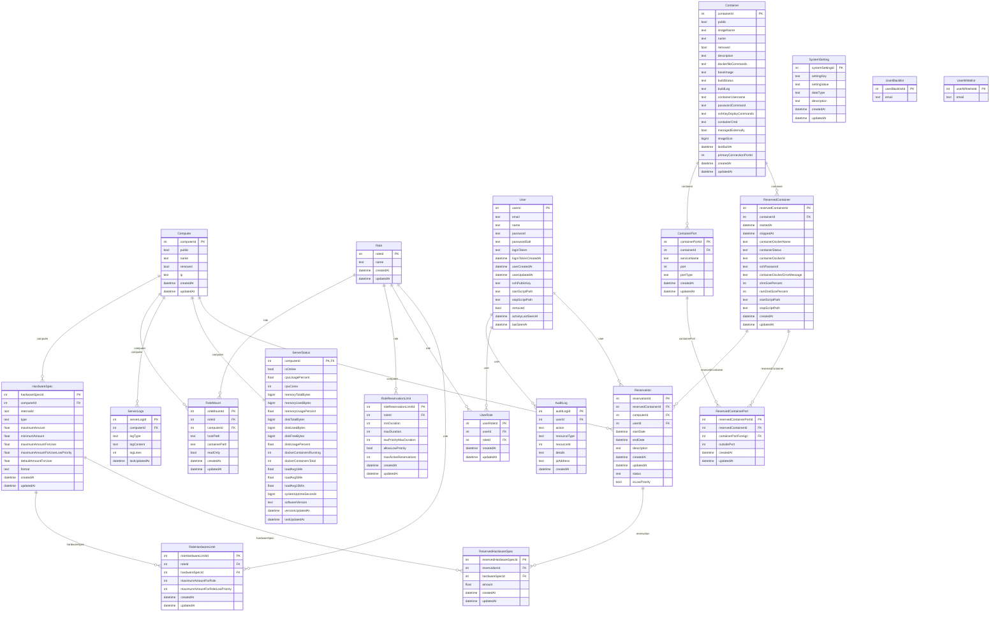

# Database ER Diagram

> **Auto-generated** from SQLAlchemy models in `webapp/backend/database.py`.
> Do not edit manually. Regenerate with: `make generate-db-diagram`

```mermaid
erDiagram
    Computer {
        int computerId PK
        bool public
        text name
        bool removed
        text ip
        datetime createdAt
        datetime updatedAt
    }
    Container {
        int containerId PK
        bool public
        text imageName
        text name
        bool removed
        text description
        text dockerfileCommands
        text baseImage
        text buildStatus
        text buildLog
        text containerUsername
        text passwordCommand
        text sshKeyDeployCommands
        text containerCmd
        bool managedExternally
        bigint imageSize
        datetime lastBuiltAt
        int primaryConnectionPortId
        datetime createdAt
        datetime updatedAt
    }
    Role {
        int roleId PK
        text name
        datetime createdAt
        datetime updatedAt
    }
    SystemSetting {
        int systemSettingId PK
        text settingKey
        text settingValue
        text dataType
        text description
        datetime createdAt
        datetime updatedAt
    }
    User {
        int userId PK
        text email
        text name
        text password
        text passwordSalt
        text loginToken
        datetime loginTokenCreatedAt
        datetime userCreatedAt
        datetime userUpdatedAt
        text sshPublicKey
        text startScriptPath
        text stopScriptPath
        bool removed
        datetime activityLastSeenAt
        datetime lastSeenAt
    }
    UserBlacklist {
        int userBlacklistId PK
        text email
    }
    UserWhitelist {
        int userWhitelistId PK
        text email
    }
    AuditLog {
        int auditLogId PK
        int userId FK
        text action
        text resourceType
        int resourceId
        text details
        text ipAddress
        datetime createdAt
    }
    ContainerPort {
        int containerPortId PK
        int containerId FK
        text serviceName
        int port
        text portType
        datetime createdAt
        datetime updatedAt
    }
    HardwareSpec {
        int hardwareSpecId PK
        int computerId FK
        text internalId
        text type
        float maximumAmount
        float minimumAmount
        float maximumAmountForUser
        float maximumAmountForUserLowPriority
        float defaultAmountForUser
        text format
        datetime createdAt
        datetime updatedAt
    }
    ReservedContainer {
        int reservedContainerId PK
        int containerId FK
        datetime startedAt
        datetime stoppedAt
        text containerDockerName
        text containerStatus
        text containerDockerId
        text sshPassword
        text containerDockerErrorMessage
        int shmSizePercent
        int ramDiskSizePercent
        text startScriptPath
        text stopScriptPath
        datetime createdAt
        datetime updatedAt
    }
    RoleMount {
        int roleMountId PK
        int roleId FK
        int computerId FK
        text hostPath
        text containerPath
        bool readOnly
        datetime createdAt
        datetime updatedAt
    }
    RoleReservationLimit {
        int roleReservationLimitId PK
        int roleId FK
        int minDuration
        int maxDuration
        int lowPriorityMaxDuration
        bool allowLowPriority
        int maxActiveReservations
        datetime createdAt
        datetime updatedAt
    }
    ServerLogs {
        int serverLogId PK
        int computerId FK
        text logType
        text logContent
        int logLines
        datetime lastUpdatedAt
    }
    ServerStatus {
        int computerId PK,FK
        bool isOnline
        float cpuUsagePercent
        int cpuCores
        bigint memoryTotalBytes
        bigint memoryUsedBytes
        float memoryUsagePercent
        bigint diskTotalBytes
        bigint diskUsedBytes
        bigint diskFreeBytes
        float diskUsagePercent
        int dockerContainersRunning
        int dockerContainersTotal
        float loadAvg1Min
        float loadAvg5Min
        float loadAvg15Min
        bigint systemUptimeSeconds
        text softwareVersion
        datetime versionUpdatedAt
        datetime lastUpdatedAt
    }
    UserRole {
        int userRoleId PK
        int userId FK
        int roleId FK
        datetime createdAt
        datetime updatedAt
    }
    Reservation {
        int reservationId PK
        int reservedContainerId FK
        int computerId FK
        int userId FK
        datetime startDate
        datetime endDate
        text description
        datetime createdAt
        datetime updatedAt
        text status
        bool isLowPriority
    }
    ReservedContainerPort {
        int reservedContainerPortId PK
        int reservedContainerId FK
        int containerPortForeign FK
        int outsidePort
        datetime createdAt
        datetime updatedAt
    }
    RoleHardwareLimit {
        int roleHardwareLimitId PK
        int roleId FK
        int hardwareSpecId FK
        int maximumAmountForRole
        int maximumAmountForRoleLowPriority
        datetime createdAt
        datetime updatedAt
    }
    ReservedHardwareSpec {
        int reservedHardwareSpecId PK
        int reservationId FK
        int hardwareSpecId FK
        float amount
        datetime createdAt
        datetime updatedAt
    }

    User ||--o{ AuditLog : "user"
    Container ||--o{ ContainerPort : "container"
    Computer ||--o{ HardwareSpec : "computer"
    Container ||--o{ ReservedContainer : "container"
    Role ||--o{ RoleMount : "role"
    Computer ||--o{ RoleMount : "computer"
    Role ||--o{ RoleReservationLimit : "role"
    Computer ||--o{ ServerLogs : "computer"
    Computer ||--|| ServerStatus : "computer"
    User ||--o{ UserRole : "user"
    Role ||--o{ UserRole : "role"
    ReservedContainer ||--o{ Reservation : "reservedContainer"
    Computer ||--o{ Reservation : "computer"
    User ||--o{ Reservation : "user"
    ReservedContainer ||--o{ ReservedContainerPort : "reservedContainer"
    ContainerPort ||--o{ ReservedContainerPort : "containerPort"
    Role ||--o{ RoleHardwareLimit : "role"
    HardwareSpec ||--o{ RoleHardwareLimit : "hardwareSpec"
    Reservation ||--o{ ReservedHardwareSpec : "reservation"
    HardwareSpec ||--o{ ReservedHardwareSpec : "hardwareSpec"
```
